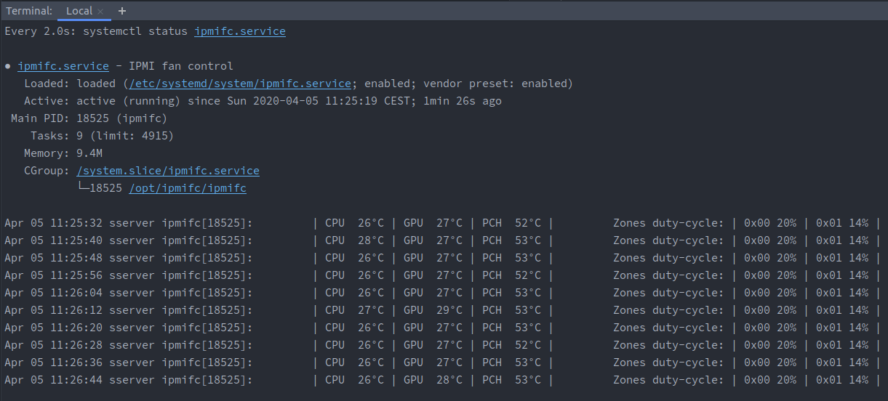

# ipmifc (ipmi fan control)

`ipmifc` is a simple program to remotely (or locally) control fan speeds (and thresholds) on machines that use the Intelligent Platform Management Interface (IPMI) based on the readings of temperature sensors (CPU, GPU or any sensor you can grab via command line).  
Simply install it and tweaks config files as needed, they will be hot-reloaded automatically after saving changes.

#### WARNING
This program is of public domain and provided as-is, without any warranty whatsoever.  
It has only been tested on a SuperMicro X11SPA-TF motherboard running Ubuntu 18.04 and 19.10.  
`ipmifc` sends raw IPMI commands to your IPMI device and may not work on your platform without some modifications.  
**USE AT YOUR OWN RISK**.

## Requirements
Precompiled executable are inside artifacts dir, config files must reside in the working dir if you use these ...or you can build it for yourself if you have `go` installed.  

Compile-time, optional: `go` language.  
Run-time, mandatory: `ipmitool`. 

## Quick start

#### Ubuntu / Debian:
Simply use the makefile and adjust the two config files according to your needs:
```sh
sudo make install_linux path=/opt/ipmifc
```
This will:
- Build the executable for the current platform to the specified path (eg.:/opt/ipmifc).
- Copy the config files to the same path (will not be overwritten if exist).
- Install `ipmitool` if not already installed.
- Setup a systemd service (ipmifc), enable and start it. 



At this point you just have to play with the configs ([`ipmifc.yaml`](./artifacts/ipmifc.yaml) and [`ipmifc_thresholds.yaml`](./artifacts/ipmifc_thresholds.yaml)) which has been copied in '/opt/ipmifc'.  
They will be reloaded automatically after saving changes, just wait for the next check cycle (check_interval is defined in the config itself).  
You can monitor `ipmifc` status at any time with:
````bash
journalctl -f -u ipmifc
````

#### Other platforms:
1. Ensure target machine has `ipmitool` installed.  
    On OSX use brew:
    ```bash
    brew install ipmitool
    ```
2. If you have `go` installed build the executable and copy the configs to the desired path.
    ```sh
    sudo make build path=/opt/ipmifc
    ```
   ...otherwise manually copy the right precompiled executable and both config files in the same destination path.
3. Run the executable as a daemon.
4. Monitor its stdout.
5. Stress your machine to see if it works!

## Configuration & Usage

Two config files are required for `ipmifc` to run.  
Anytime you save some changes the configs are hot-reloaded (separately).  
The configuration options are documented in the sample files:  

[`ipmifc_thresholds.yaml`](./artifacts/ipmifc_thresholds.yaml):   

```yaml
fan_thresholds:
  # Grab the fan name running `sudo ipmitool sensor`.
  FAN1:
    # description is arbitrary, use what you prefer
    description: pump
    # lower thresholds: Non-Recoverable, Critical and Non-Critical
    lower: [0, 300, 500]
    # upper thresholds: Non-Critical, Critical and Non-Recoverable
    upper: [4900, 5000, 5100]

  FAN3:
    description: NF-A14 (top)
    lower: [0, 100, 200]
    upper: [1600, 1700, 1800]

  FAN4:
    description: NF-A12 (side)
    lower: [0, 300, 400]
    upper: [2100, 2200, 2300]
```

[`ipmifc.yaml`](./artifacts/ipmifc.yaml):  

```yaml
ipmi_cmd: ipmitool # for remote control use: `ipmitool -I lanplus -U '<ipmi_user>' -P '<ipmi_password>' -H <remote_ip>`

# These settings may vary...
#
# IPMI modes:
# - Standard = "00"
# - Full     = "01"
# - Optimal  = "02"
# - HeavyIO  = "04"
#
# Custom mode:
# - Custom   = "custom"
# Custom mode will set native FullMode under the hood,
# it will also enable control with the below controllers.
# Editing the ipmi zones duty-cycle without setting the full mode first will non work.
fan_mode: custom

# Number of seconds to sleep between checks.
# Check configuration changes and sensors data every x seconds.
check_interval: 8

# `fan_mode` must be "custom" in order for this to work.
controllers:

  # name is arbitrary, will be printed in logs.
  - name: CPU
    # IPMI sensor entityID to look for.
    # Get the ipmi sensor entityID with: `sudo ipmitool sdr elist full` at the fourth column in result.
    # ... or with: `sudo ipmitool sensor get <sensor_id>` (eg.: sudo ipmitool sensor get 'CPU Temp')
    temp_ipmi_entity: 3.1
    # The minimum change in °C from the last update to actually cause another fan speed change.
    min_temp_change: 2
    # The targets that we want to control by this sensor.
    # Usually cpu zone: 0x00, i/o zone: 0x01.
    targets:
      0x00:
        # Define a map for every target zone with temp (°C) and fans duty-cycle (%).
        0: 20
        36: 24
        42: 32
        60: 72
        72: 100


  - name: GPU
    # Direct command to extract NVIDIA GPU temp here replace the `temp_ipmi_entity` var.
    # Should return a string representing a valid float number,
    # leading and trailing spaces will be automatically removed.
    # If both `temp_cmd` and `temp_ipmi_entity` are present `temp_cmd` takes precedence.
    temp_cmd: nvidia-smi --query-gpu=temperature.gpu --format=csv,noheader
    min_temp_change: 2
    targets:
      0x00:
        0: 20
        35: 30
        50: 50
        65: 75
        80: 100


  - name: PCH
    temp_ipmi_entity: 7.1
    min_temp_change: 2
    # Control multiple target zones with the same sensor...
    targets:
      0x00:
        0: 20
        60: 50
        72: 100
      0x01:
        0: 14
        54: 30
        60: 54
        66: 86
        72: 100
```
