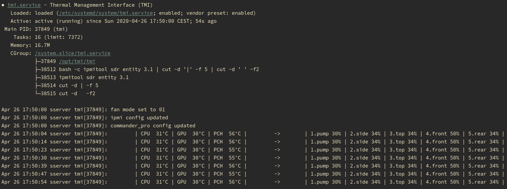

# TMI (Thermal Management Interface)

***tmi*** is a simple program to control fan/pump speeds based on the readings of temperature sensors.  
Temperature extractors and fan controllers are implemented as hot-swappable Go plugins and so they are completely decoupled.  

The package include 3 plugins:
- `ipmi` for IPMI (Intelligent Platform Management Interface) which can also control remote machines.
- `commanderpro` for Corsair Commander Pro which also includes led control.
- `cli` for command line operations (GPU and any other sensor you can grab via command line).
  
Simply install it and tweaks config files as needed, they will be hot-reloaded automatically after saving changes.

#### Disclaimer
> __WARNING__: ***tmi*** is not an official Corsair product. Corsair and Corsair Commander Pro are trademarks or registered trademarks of Corsair Components, Inc. The trademark holders are not affiliated with the maker of this product and do not endorse this product.  
This project is born because I wanted to handle the thermal/acoustic behaviour of my personal workstation so it is not intended to be used in production environments.  
This program is of public domain and provided as-is, without any warranty whatsoever.  
It has only been tested on a SuperMicro X11SPA-TF motherboard running Ubuntu 18.04 and 19.10.  
***tmi*** sends raw IPMI commands to your IPMI device and to the Commander Pro and may not work on your platform without some modifications.  
**USE AT YOUR OWN RISK**.

## Features
- control ipmi fan zones duty-cycle.
- control ipmi fans thresholds.
- get ipmi temperature from sensors.
- control Commander Pro fans duty-cycle.
- control Commander Pro leds (basic control).
- get Commander Pro temp from sensors.
- get temp from any custom CLI command.


## Requirements
Precompiled executable are inside artifacts dir, config files must reside in the working dir if you use these ...or you can build it for yourself if you have `go` installed using the included makefile for convenience.  


- `ipmitool` to use IPMI. 
- `libusb-1.0` to communicate with the Corsair Commander Pro. 

## Quick start

#### Ubuntu / Debian:
Simply use the makefile and adjust the three config files according to your needs:
```sh
sudo --preserve-env=PATH make install_linux path=/opt/tmi
```
This will:
- Build the executable for the current platform to the specified path (eg.:/opt/tmi).
- Build all the plugins to the same folder.
- Copy the config files to the same path (will not be overwritten if exist).
- Install `ipmitool` and `libusb` if not already installed.
- Setup a systemd service (tmi), enable and start it. 



At this point you just have to play with the configs ([`tmi.yaml`](./tmi.yaml) and the ones relative to the plugins) which has been copied in '/opt/tmi'.  
They will be reloaded automatically after saving changes (separately), just wait for the next check cycle (check_interval is defined in the tmi.yaml config itself).  
You can monitor `tmi` status at any time with:
````bash
journalctl -f -u tmi
````

#### Other platforms:
1. Ensure target machine has `ipmitool` and `libusb` installed.  
    On OSX use brew:
    ```bash
    brew install ipmitool
    brew install libusb
    ```
2. Build the executable and copy the configs to the desired path.
    ```sh
    sudo make build path=/opt/tmi
    ```
3. Compile plugins:
    ```sh
    sudo make build_plugins path=/opt/tmi
   ```
4. Run the executable as a daemon.
5. Monitor its stdout.
6. Stress your machine to see if it works!

## Configuration & Usage

`tmi` needs its config file to run.  
Anytime you save some changes the configs are hot-reloaded.  
The configuration options are documented in the sample files.

[`tmi.yaml`](./tmi.yaml):  

```yaml
# Plugins to load.
plugins:
  - cli
  - ipmi
  - commanderpro

# Number of seconds to sleep between checks.
# Check configuration changes and sensors data every x seconds.
check_interval: 3

# Create a targets map to be used as reference inside the controllers configuration below.
# <arbitrary_name>: <fan_controller>.<fan_controller_channel>
targets_map:
  pump: ipmi.0
  side: commanderpro.0
  top: commanderpro.1
  front: commanderpro.2
  rear: commanderpro.3

controllers:

  # name is arbitrary, will be printed in logs.
  - name: CPU
    # The minimum change in °C from the last update to actually cause another fan speed change.
    min_temp_change: 4
    # IPMI sensor entityID to look for.
    # Get the ipmi sensor entityID with: `sudo ipmitool sdr elist full` at the fourth column in result.
    # ... or with: `sudo ipmitool sensor get <sensor_id>` (eg.: sudo ipmitool sensor get 'CPU Temp')
    temp:
      plugin: ipmi
      # commanderpro: sensor_channel (uint8 as string), ipmi: entityID, cli: custom_command
      arg: 3.1
    # Control multiple target zones with the same sensor...
    targets:
      pump:
        0:  30
        36: 50
        54: 72
        60: 100
      side:
        0: 0
        35: 30
        45: 50
        55: 75
        65: 100
      top:
        0: 18
        35: 30
        45: 50
        55: 75
        65: 100

  - name: GPU
    min_temp_change: 2
    # CLI command to extract NVIDIA GPU temp.
    # Should return a string representing a valid float number,
    # leading and trailing spaces will be automatically removed.
    temp:
      plugin: cli
      arg: nvidia-smi --query-gpu=temperature.gpu --format=csv,noheader
    targets:
      pump:
        0: 30
        45: 50
        55: 75
        65: 100
      side:
        0: 0
        35: 30
        45: 50
        55: 75
        65: 100
      top:
        0: 18
        35: 30
        45: 50
        55: 75
        65: 100

  - name: PCH
    min_temp_change: 3
    temp:
      plugin: ipmi
      arg: 7.1
    targets:
      front:
        0: 34
        56: 70
        63: 100
      rear:
        0: 18
        53: 30
        56: 50
        63: 100
```
## License

tmi is available under the MIT license. See the [LICENSE](./LICENSE) file for more information.
